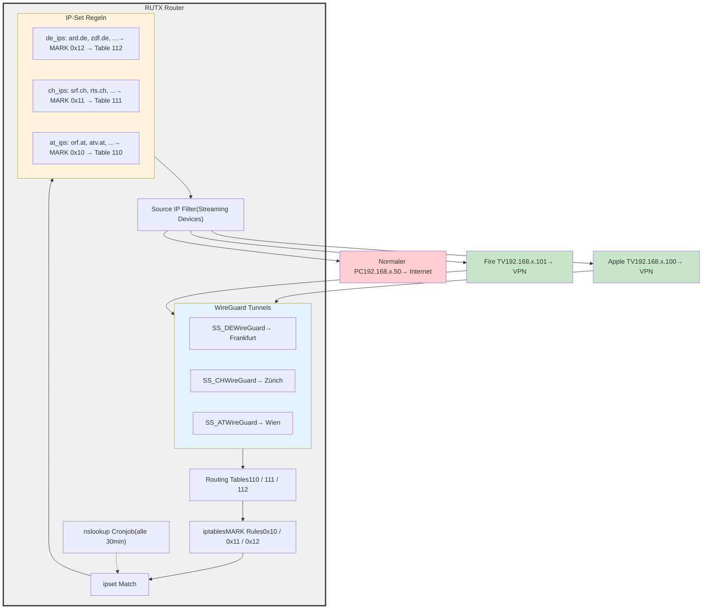

# RUTX Multi-VPN - DNS-basiertes Split-Tunneling

DNS-basiertes Multi-Tunnel Split-Tunneling fuer Streaming auf Teltonika RUTX Routern.

**Keine zusaetzlichen Pakete erforderlich** - funktioniert mit Standard-Firmware!

## Features

- **Automatisches Geo-Routing**: ARD/ZDF -> DE Tunnel, SRF -> CH Tunnel, ORF -> AT Tunnel
- **Nur Streaming Devices**: Normale Geraete gehen direkt ins Internet
- **Mehrere Tunnel gleichzeitig**: WireGuard DE, CH, AT laufen parallel
- **Firmware-Update sicher**: Keine opkg-Pakete, ueberlebt Updates
- **Multi-Device Support**: Beliebig viele Streaming-Geraete (Komma, Semikolon oder Leerzeichen getrennt)
- **Management VPN Schutz**: WG/MGMT/HOME/VPN Interfaces werden NIEMALS angefasst
- **Home Assistant Integration**: Ein/Aus Schalter, Status mit Flaggen-Emojis, Provisioning Buttons

## Architektur



## Datenfluss

```
1. Cronjob (alle 30 Min) loest Streaming-Domains per nslookup auf
                    |
                    v
2. IPs werden in ipsets gespeichert (de_ips, ch_ips, at_ips)
   mit 24h Timeout
                    |
                    v
3. Streaming Device macht Verbindung zu Streaming-IP
                    |
                    v
4. iptables PREROUTING:
   - Prueft Source IP (ist es Streaming Device?)
   - Prueft Destination IP (ist sie in de_ips/ch_ips/at_ips?)
   - Setzt MARK (0x12 fuer DE, 0x11 fuer CH, 0x10 fuer AT)
                    |
                    v
5. ip rule: MARK 0x12 -> verwende Routing Table 112
                    |
                    v
6. Routing Table 112: default via SS_DE Interface
                    |
                    v
7. Traffic geht durch WireGuard Tunnel nach Frankfurt
                    |
                    v
8. Surfshark Server in Frankfurt -> ARD Mediathek
```

## Voraussetzungen

### Surfshark Account

Du brauchst einen Surfshark Account mit WireGuard-Unterstuetzung:

1. **Surfshark Login**: https://my.surfshark.com/
2. **Manual Setup** -> **Router** -> **WireGuard**
3. **Generate Key Pair** (oder vorhandenes verwenden)
4. **Location waehlen**:
   - Deutschland (z.B. Frankfurt)
   - Schweiz (z.B. Zuerich)
   - Oesterreich (z.B. Wien)
5. **Config herunterladen**

### WireGuard Config Format

Die heruntergeladene Config sieht so aus:

```ini
[Interface]
PrivateKey = DEIN_PRIVATE_KEY
Address = 10.14.0.2/16
DNS = 162.252.172.57

[Peer]
PublicKey = SERVER_PUBLIC_KEY
AllowedIPs = 0.0.0.0/0
Endpoint = de-fra.prod.surfshark.com:51820
```

**Wichtig**:
- Pro Land eine Config herunterladen
- Alle Configs verwenden denselben Private Key
- Der Public Key ist pro Server unterschiedlich

## Installation

### 1. Package kopieren

```bash
# Nach /config/packages/rutx_multivpn/
cp -r rutx_multivpn /config/packages/
```

### 2. WireGuard Configs ablegen

Surfshark WireGuard Configs in `profiles/` ablegen:

```
profiles/
  wg_DE_surfshark.conf   # Deutschland (Frankfurt)
  wg_CH_surfshark.conf   # Schweiz (Zuerich)
  wg_AT_surfshark.conf   # Oesterreich (Wien)
```

**Namenskonvention**: `wg_<LAND>_<provider>.conf`

Das Script erkennt das Land automatisch aus dem Dateinamen!

### 3. Home Assistant configuration.yaml

```yaml
homeassistant:
  packages: !include_dir_named packages
```

### 4. SSH Key einrichten

```bash
# SSH Key generieren und auf RUTX kopieren
./scripts/setup_ssh_key.sh 192.168.110.1
```

Oder manuell:
```bash
# Auf HA
ssh-keygen -t rsa -b 4096 -f /config/.ssh/id_rsa -N ""

# Key auf RUTX kopieren
ssh-copy-id -i /config/.ssh/id_rsa root@192.168.110.1
```

### 5. In Home Assistant

1. **RUTX IP eintragen**: `input_text.rutx_multivpn_host` -> z.B. `192.168.110.1`
2. **Streaming Device IPs**: `input_text.rutx_multivpn_streaming_devices`
   - Trennzeichen: Komma, Semikolon oder Leerzeichen
   - Beispiel: `192.168.110.100, 192.168.110.101, 192.168.110.102`
3. **Button "Setup" druecken** - Initiales Provisioning
4. **Toggle "Multi-VPN" einschalten**

## Lovelace Dashboard

Kopiere den Inhalt von `lovelace_card.txt` in dein Dashboard.

**Benoetigt**: `custom:button-card` (via HACS installieren)

Features:
- Flaggen-Emojis fuer Tunnel-Status
- IP-Counter pro Land
- Setup/Refresh/Diagnose/Cleanup Buttons

## Persistenz

### Was ueberlebt Firmware-Updates

- WireGuard Interface Konfiguration (UCI)
- Routing Tabellen in `/etc/iproute2/rt_tables`
- Scripts in `/root/multivpn/`
- Config in `/root/multivpn/config`
- Domain-Listen in `/root/multivpn/domains/`
- Autostart in `/etc/rc.local`

### Was bei jedem Start neu erstellt wird

- ipsets (mit IPs aus nslookup)
- iptables MARK Regeln
- ip rules fuer Policy Routing

**Keine opkg-Pakete noetig!** Das System verwendet nur Standard-Tools:
- `nslookup` (BusyBox)
- `ipset` (Standard in OpenWrt)
- `iptables` (Standard)
- `wg` (WireGuard, Standard in RUTX)

## Streaming Domains

Die Domain-Listen in `domains/` enthalten die Streaming-Hostnamen:

### de_streaming.txt
```
# ARD
ard.de
daserste.de
ardmediathek.de
# ... und CDN-Server
```

### ch_streaming.txt
```
# SRF/SRG
srf.ch
rts.ch
play.swissinfo.ch
# ... und CDN-Server
```

### at_streaming.txt
```
# ORF
orf.at
tvthek.orf.at
# ... und CDN-Server
```

**Tipp**: Weitere Domains hinzufuegen wenn ein Dienst nicht funktioniert!

## Home Assistant Entities

### Input Helpers

| Entity | Beschreibung |
|--------|-------------|
| `input_boolean.rutx_multivpn_enabled` | Multi-VPN Ein/Aus |
| `input_text.rutx_multivpn_host` | RUTX IP Adresse |
| `input_text.rutx_multivpn_streaming_devices` | Streaming Device IPs (Komma/Semikolon/Leerzeichen) |

### Sensoren

| Entity | Beschreibung |
|--------|-------------|
| `sensor.rutx_multi_vpn_tunnel_de` | DE Tunnel Status (An/Aus) |
| `sensor.rutx_multi_vpn_tunnel_ch` | CH Tunnel Status (An/Aus) |
| `sensor.rutx_multi_vpn_tunnel_at` | AT Tunnel Status (An/Aus) |
| `sensor.rutx_multi_vpn_de_ips` | Anzahl IPs im DE ipset |
| `sensor.rutx_multi_vpn_ch_ips` | Anzahl IPs im CH ipset |
| `sensor.rutx_multi_vpn_at_ips` | Anzahl IPs im AT ipset |

### Buttons

| Button | Beschreibung |
|--------|-------------|
| Setup | Initial Setup ausfuehren |
| Refresh | Status aktualisieren |
| Diagnose | Ausfuehrliche Diagnose |
| Cleanup | Konfiguration entfernen (mit Bestaetigung) |

## Troubleshooting

### SSH Verbindung pruefen

```bash
ssh -i /config/.ssh/id_rsa root@192.168.110.1 "echo OK"
```

### Tunnel Status auf RUTX

```bash
ssh root@RUTX_IP "/root/multivpn/vpn-control.sh status"
```

### ipset Inhalt pruefen

```bash
# Alle IPs im deutschen ipset anzeigen
ssh root@RUTX_IP "ipset list de_ips"

# Anzahl IPs
ssh root@RUTX_IP "ipset list de_ips | grep -c '^[0-9]'"
```

### IP-Update manuell ausfuehren

```bash
ssh root@RUTX_IP "/root/multivpn/update-ips.sh"
```

### iptables Regeln pruefen

```bash
# MARK Regeln (Streaming Device -> ipset match)
ssh root@RUTX_IP "iptables -t mangle -L PREROUTING -v -n | grep MARK"
```

Erwartete Ausgabe (3 Regeln pro Streaming Device):
```
0     0 MARK  all  --  *  *  192.168.110.100  0.0.0.0/0  match-set at_ips dst MARK set 0x10
0     0 MARK  all  --  *  *  192.168.110.100  0.0.0.0/0  match-set ch_ips dst MARK set 0x11
0     0 MARK  all  --  *  *  192.168.110.100  0.0.0.0/0  match-set de_ips dst MARK set 0x12
```

### WireGuard Tunnel pruefen

```bash
# Tunnel-Status
ssh root@RUTX_IP "wg show"

# Transfer-Statistik (zeigt ob Traffic fliesst)
ssh root@RUTX_IP "wg show SS_DE | grep transfer"
```

### Routing pruefen

```bash
# Routing Rules
ssh root@RUTX_IP "ip rule show"

# Routing Table fuer DE (112)
ssh root@RUTX_IP "ip route show table 112"
```

### Streaming funktioniert nicht?

1. **Pruefe ob Device in iptables**:
   ```bash
   ssh root@RUTX_IP "iptables -t mangle -L PREROUTING -v -n | grep DEINE_IP"
   ```

2. **Pruefe ob Domain aufgeloest wurde**:
   ```bash
   ssh root@RUTX_IP "ipset test de_ips IP_DER_STREAMING_SEITE"
   ```

3. **Pruefe VPN-Traffic**:
   ```bash
   ssh root@RUTX_IP "wg show SS_DE"
   ```
   -> `transfer: X received, Y sent` sollte steigen

4. **Manuelles IP-Update**:
   ```bash
   ssh root@RUTX_IP "/root/multivpn/update-ips.sh"
   ```

### VPN Provider blockt Streaming?

Manche Streaming-Dienste erkennen VPN-Server. Loesungen:
- Anderen Surfshark Server waehlen
- Anderen VPN-Provider testen
- Eigenen VPN-Server aufsetzen

## Sicherheit

### Geschuetzte Management VPNs

Folgende Interface-Namen werden **NIEMALS** angefasst:
- `WG` / `wg`
- `MGMT` / `mgmt`
- `HOME` / `home`
- `VPN` / `vpn`

### Streaming Tunnel Prefix

Alle Streaming Tunnel verwenden das Prefix `SS_`:
- `SS_DE` - Deutschland
- `SS_CH` - Schweiz
- `SS_AT` - Oesterreich

## Dateien

```
rutx_multivpn/
  README.md                      # Diese Dokumentation
  rutx_multivpn.yaml             # HA Package
  lovelace_card.txt              # Dashboard Card YAML
  profiles/                      # WireGuard Configs (von Surfshark)
    wg_DE_surfshark.conf
    wg_CH_surfshark.conf
    wg_AT_surfshark.conf
  domains/                       # Streaming Domain Listen
    de_streaming.txt
    ch_streaming.txt
    at_streaming.txt
  scripts/
    rutx_multivpn_cmd.sh         # HA Command Wrapper
    rutx_multivpn_provision.sh   # Initial Setup (von HA)
    rutx-multivpn-setup.sh       # RUTX Setup Script
    rutx-multivpn-cleanup.sh     # Cleanup Script
    update-ips.sh                # IP-Update via nslookup
    setup_ssh_key.sh             # SSH Key Generator
```

## FAQ

### Warum kein dnsmasq-full mehr?

Die frueheren Versionen verwendeten `dnsmasq-full` mit ipset-Support. Problem:
- Muss via `opkg install` installiert werden
- Geht bei jedem Firmware-Update verloren
- Router crashte manchmal nach Updates

Die neue Version verwendet `nslookup` + Cronjob - keine zusaetzlichen Pakete noetig!

### Wie oft werden IPs aktualisiert?

Alle 30 Minuten via Cronjob. Die IPs haben ein 24h Timeout im ipset.

### Kann ich mehr als 3 Laender hinzufuegen?

Ja! Dazu musst du:
1. Neue WireGuard Config: `profiles/wg_XX_surfshark.conf`
2. Neue Domain-Liste: `domains/xx_streaming.txt`
3. Setup Script anpassen (neue Routing Table, neues ipset)

### Funktioniert das auch mit anderen VPN-Providern?

Ja, solange sie WireGuard unterstuetzen. Die Config muss nur im richtigen Format sein.

### Mein normales Internet ist langsamer geworden?

Das sollte nicht passieren! Nur Traffic von den Streaming Devices zu den Streaming-IPs geht durch VPN. Pruefe:
- Ist dein PC in der Streaming Devices Liste? -> Rausnehmen!
- iptables-Regeln korrekt? -> `iptables -t mangle -L PREROUTING -v -n`
